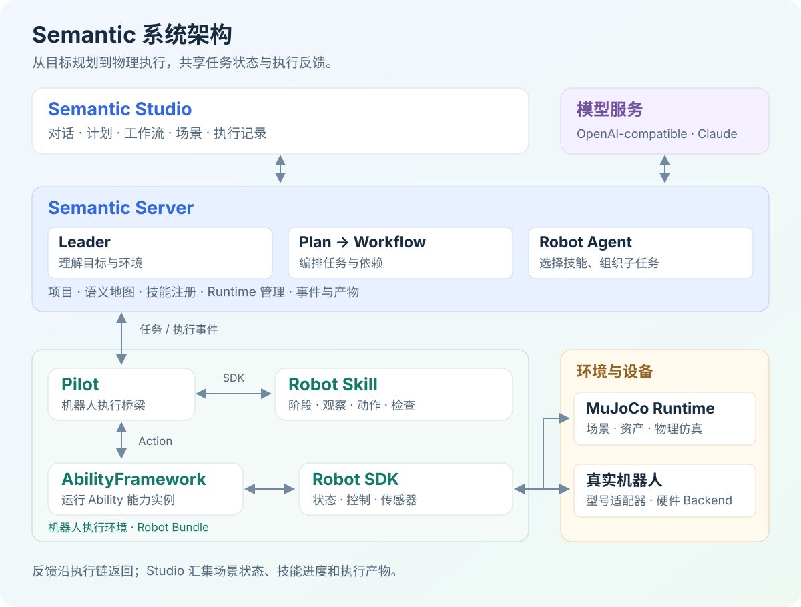

  

  <h3>InsightOS Community · 具身智能应用与组件生态</h3>

  

    
    
    
  

  

    <a href="README.md">English</a> · <b>简体中文</b> 
    <a href="#快速开始">快速开始</a> · <a href="#系统架构">系统架构</a> · <a href="#组件生态">组件生态</a> · <a href="https://github.com/insightos-community/semantic-docs/tree/main/docs">项目文档</a> · <a href="https://github.com/insightos-community/Semantic-Framework/issues">问题反馈</a>
  

---
InsightOS Semantic 是具识智能面向具身场景打造的语义智能体系统。它以语义连接机器人本体、环境、任务、Skill 和运行经验，将自然语言需求转化为机器人可以执行的任务，并贯通**理解—规划—执行—进化**的完整闭环。

InsightOS Semantic 支持售货仓取货配送、拆码垛搬运、多机协同流水线、定时巡检等场景，可连接人形机器人、四足机器人、机械臂和移动机器人等多种本体。

这里是 **InsightOS Community 组织门户**，提供产品概览、组件生态和社区协作入口。安装使用与框架开发请前往 [Semantic-Framework 产品主仓](https://github.com/insightos-community/Semantic-Framework)。

## 为什么选择 Semantic？

机器人从“能演示”走向“能干活”，通常面临三类问题：

- **不能理解**：任务依赖固定代码，难以理解人的意图和场景约束。
- **不懂变通**：环境、物体或执行状态发生变化时，固定流程难以继续。
- **不会进化**：执行经验难以沉淀，换本体、换场景后往往需要重新开发。

InsightOS Semantic 使用统一语义连接任务、环境、本体和能力，让机器人可以理解目标、组织 Skill、执行任务，并将运行经验沉淀为可复用能力。

## 系统架构

系统由应用交互、任务编排、机器人执行和环境设备四个部分组成，通过任务指令与执行反馈协同工作。

  

| 层次 | 主要模块 | 职责 |
|:--|:--|:--|
| **应用交互** | Semantic Studio、模型服务 | 用户在 Studio 中描述目标、审阅计划并查看结果；模型服务为智能体提供理解与推理能力。 |
| **任务编排** | Semantic Server | Leader 理解目标与环境，Workflow 组织任务和依赖，Robot Agent 选择技能并安排子任务。 |
| **机器人执行** | Pilot、Robot Skill、AbilityFramework、Robot SDK | Robot Skill 组织操作阶段，Pilot 分发动作，AbilityFramework 运行能力实例，Robot SDK 连接设备并返回观察与结果。 |
| **环境与设备** | MuJoCo Runtime、真实机器人 | MuJoCo 提供场景与物理仿真；真实机器人通过适配器与硬件接口接入，在现场执行动作并提供反馈。 |

## 核心 Features

- **自然语言任务交互**：通过一句话描述目标，由系统组织任务和 Skill。
- **多机器人协同**：面向异构机器人分配任务并协调工作流程。
- **语义世界模型**：同时表达物体是什么、位于哪里以及彼此关系。
- **动态环境适应**：根据环境和执行状态变化调整任务过程。
- **仿真驱动开发**：连接场景、机器人、Skill 和任务，在仿真中快速验证。
- **经验与能力进化**：将执行数据和经验沉淀为可复用、可持续优化的 Skill。
- **具身应用生态**：复用场景应用、Skill、模型、插件、适配器和仿真资产。

## 快速开始

在 Linux x86_64 上使用二进制安装器体验完整系统，包括 Server、Studio、原生 MuJoCo、R1 Pro Robot Bundle、场景资产和机器人技能。

- [产品安装与首次运行](https://github.com/insightos-community/Semantic-Framework/blob/main/README.zh-CN.md#快速开始)：安装系统、登录 Studio、配置模型并创建项目。
- [Framework 开发](https://github.com/insightos-community/Semantic-Framework/blob/main/README.zh-CN.md#framework-开发)：源码结构、编译启动与 Robot Bundle 工作流。
- [详细安装指南](https://github.com/insightos-community/quick-start/blob/main/README.zh-CN.md)：完整系统安装与组件配套版本。

## 组件生态

Semantic 的组件围绕共同的任务模型和执行链路协作。本仓库维护组织主页与产品概览，你可以在这里了解整个产品，再进入对应仓库开发某一层能力。

| 层次 | 仓库 | 职责 |
|:--|:--|:--|
| 语义框架 | **[semantic-framework](https://github.com/insightos-community/Semantic-Framework)** | Server、Pilot、CLI、智能体、任务编排与共享契约。 |
| 用户界面 | [semantic-web](https://github.com/insightos-community/semantic-web) | Semantic Studio，包含项目、机器人、工作流与仿真视图。 |
| 项目文档 | [semantic-docs](https://github.com/insightos-community/semantic-docs) | 系统架构、用户指南与组件开发文档。 |
| 机器人技能 | [robot-skill](https://github.com/insightos-community/robot-skill) | Robot Skill SDK，以及导航、抓取和放置技能。 |
| 机器人能力 | [r1pro-ability](https://github.com/insightos-community/r1pro-ability) | R1 Pro 导航、机械臂运动、传感器与感知等能力。 |
| 机器人接口 | [robot-sdk](https://github.com/insightos-community/robot-sdk) | 通用机器人接口、型号适配器和 Backend。 |
| 能力引擎 | [AbilityFramework](https://github.com/insightos-community/AbilityFramework) | Ability 实例运行与生命周期管理的原生运行时。 |
| 能力开发 | [Ability-SDK-Python](https://github.com/insightos-community/Ability-SDK-Python) | 用于实现和调用 Ability 的 Python SDK。 |
| 能力工具 | [ability-scaffold](https://github.com/insightos-community/ability-scaffold) | Ability 开发与打包工具。 |
| 运行依赖 | [ability-runtime](https://github.com/insightos-community/ability-runtime) | 机器人执行环境所需的依赖包和构建输入。 |
| 仿真运行时 | [mujoco-runtime](https://github.com/insightos-community/mujoco-runtime) | 原生 MuJoCo 运行时与场景生命周期管理。 |
| 场景资产 | [mujoco-asset](https://github.com/insightos-community/mujoco-asset) | 机器人模型、物体、布局与仿真资产。 |
| 机器人部署 | [semantic-deployment](https://github.com/insightos-community/semantic-deployment) | Robot Bundle 定义与部署配置。 |
| 安装入口 | [quick-start](https://github.com/insightos-community/quick-start) | 完整系统安装、制品打包与组件版本清单。 |

## Feature Roadmap

| 阶段 | Feature 主题 |
|---|---|
| **2026 Q3：系统基础与 Public Preview** | 语义系统基础、仿真资源模型、Ability/Skill 体系、语义世界模型、本地试用与基础示例 |
| **2026 Q4：开发能力** | 流程开发、Skill 开发、仿真场景开发，以及面向开发者的 SDK 和工具链 |
| **2027 Q1：高级智能** | 经验进化、Skill 持续优化、异常感知与处理、任务恢复和动态环境适应 |
| **2027 Q2：开放生态** | 场景应用、Skill、模型、插件和仿真资源生态，软件包分发与第三方开发者共建 |

## 文档与社区

- **[Quick Start](https://github.com/insightos-community/quick-start/blob/main/README.zh-CN.md)**：安装、运行管理与组件配套版本。
- **[系统架构](https://github.com/insightos-community/semantic-docs/tree/main/docs/architecture)**：项目、智能体、任务规划、执行链路与部署关系。
- **[用户手册](https://github.com/insightos-community/semantic-docs/tree/main/docs/user)**：Studio、环境配置与机器人任务操作。
- **[开发文档](https://github.com/insightos-community/semantic-docs/tree/main/docs/developer)**：核心模块、扩展接口与组件开发。
- **[Issues](https://github.com/insightos-community/Semantic-Framework/issues)**：反馈问题，交流使用场景与功能建议。

欢迎为核心服务、Studio、机器人技能、设备适配、场景和文档贡献代码与想法。你可以先通过 Issue 描述希望支持的任务，也可以直接向对应组件仓库提交 Pull Request，并附上可复现示例与适合该变更的验证结果。协作流程见[贡献指南](https://github.com/insightos-community/semantic-docs/blob/main/docs/developer/reference/contributing/_index.md)。

## 许可证

本仓库公开的源码采用 [Apache License 2.0](LICENSE)（`Apache-2.0`）。组件仓库、二进制软件包、模型和仿真资产可能使用各自的许可证，请查看对应仓库或分发包的说明。
