# insightOS Semantic Best Practices

> This guide documents the legacy depalletizing example UI and project configuration. For the current Studio workflow, follow [Your first Project](https://github.com/insightos-community/semantic-docs/blob/main/docs/user/getting-started/first-project.md). Install the system using [Quick Start](../getting-started/quick-start.md).

[简体中文](../../zh-CN/user-guide/semantic-best-practices.md)

Standard operating steps from scene startup to workflow validation.

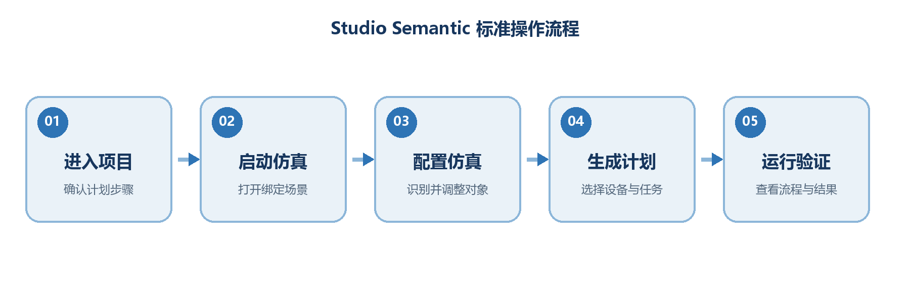

> **Reminder:** Before you start, switch the Agent to `leader-Leader-team` and make sure you are in the “Depalletizing” project.

Scope: first-time execution of the insightOS Semantic Depalletizing project, scene customization, and adding extra moving tasks.

## Before You Start

Complete the checks below before following the main flow in this guide.

| Check item | What to confirm |
| --- | --- |
| **Project** | Enter the “Depalletizing” project from the community and confirm the plan steps on the project page. |
| **Agent** | Switch to `leader-Leader-team` so that subsequent prompts and plan generation use the correct execution role. |
| **Scene** | Confirm the project is bound to a simulation scene and that robots, boxes, and the target area are visible after startup. |

**Figure 1 Plan steps on the project page**

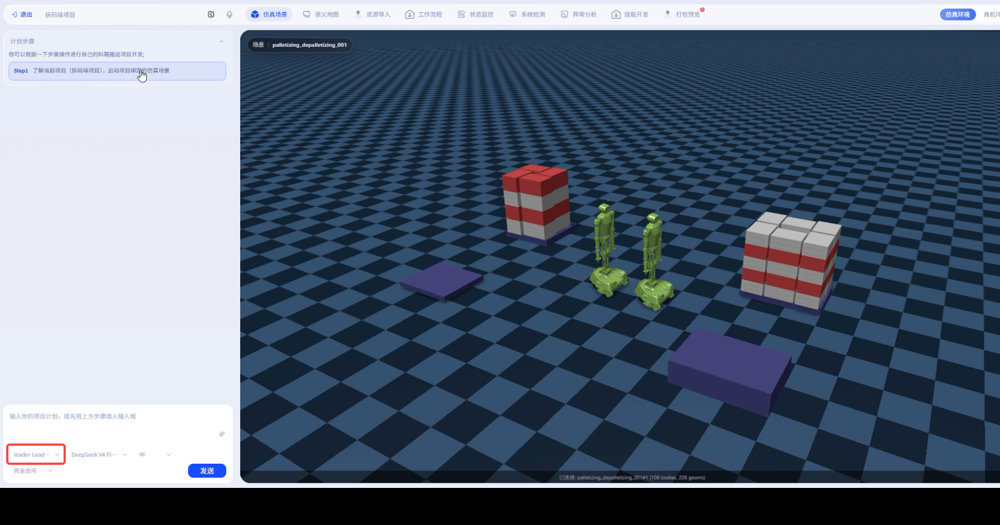

After entering from the project entry point, first confirm the plan steps and execution entry point for the current task.

## Step 1: Understand the Project and Start the Simulation Scene

**Purpose:** Open the simulation scene bound to the project and build an overall understanding of the current operation objects and environment.

- View the current scene in the Depalletizing project.
- Start the simulation scene bound to the project and wait for it to load completely.

**Figure 2 Simulation scene started**

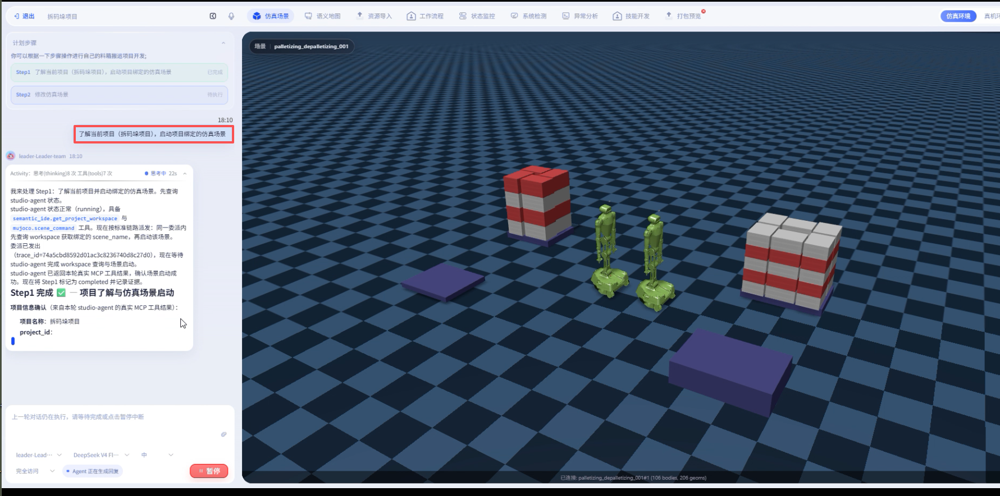

You should see the stacked boxes, robot devices, and the target area in the scene.

## Step 2: Modify the Simulation Scene as Prompted

**Purpose:** Identify and adjust the target objects based on the Agent's prompts so that the simulation configuration matches the current task requirements.

- If you need to modify boxes, first confirm the exact box names in the semantic map.
- Make personalized adjustments as prompted by the Agent; the example only changes the color of one box.

### 2.1 Confirm the Object Name in the Semantic Map

After selecting a target box, read its name in the info panel on the right. Use this name in subsequent instructions to avoid referencing the wrong object.

**Figure 3 Selecting a target box and viewing its name**

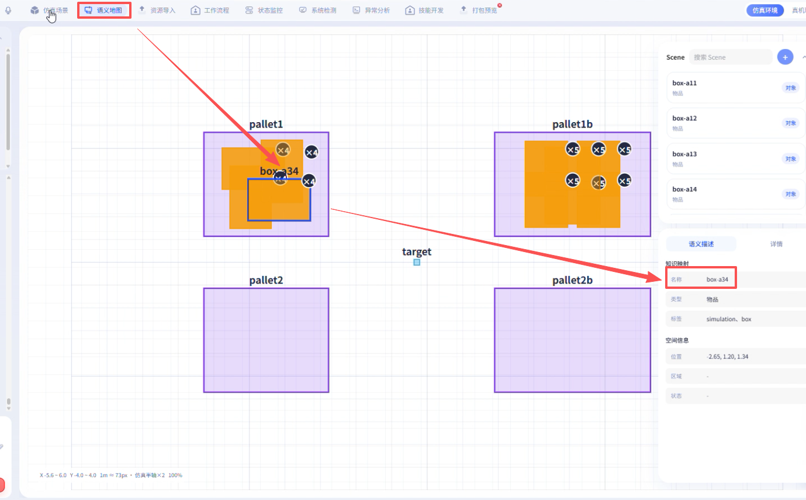

The semantic map is used to locate objects, confirm names, and identify the target area.

### 2.2 Complete the Modification as Prompted by the Agent

**Figure 4 Submitting a scene modification as prompted**

Enter a clear modification request in the conversation or configuration area.

**Figure 5 Scene state after modification**

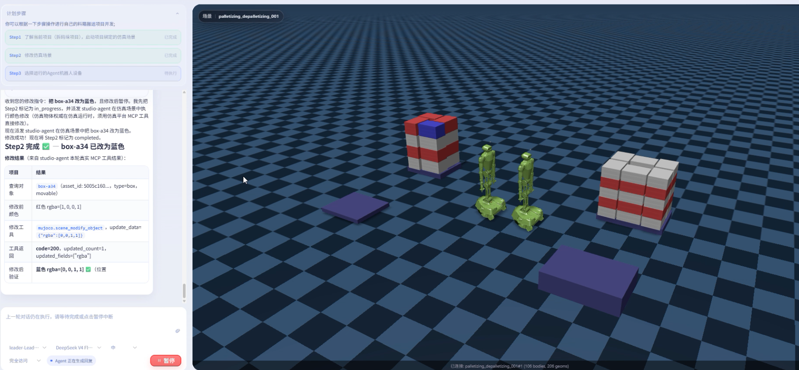

In the example, the target box color has changed, which means the personalized configuration took effect.

## Step 3: Select the Agent Robot Device to Run

**Purpose:** Assign the correct robot device for the task so the workflow can be linked to an executable resource.

- Select the robot device as prompted by the Agent.
- Confirm the device selection before creating the plan to avoid regenerating the flow later.

**Figure 6 Selecting the Agent robot device**

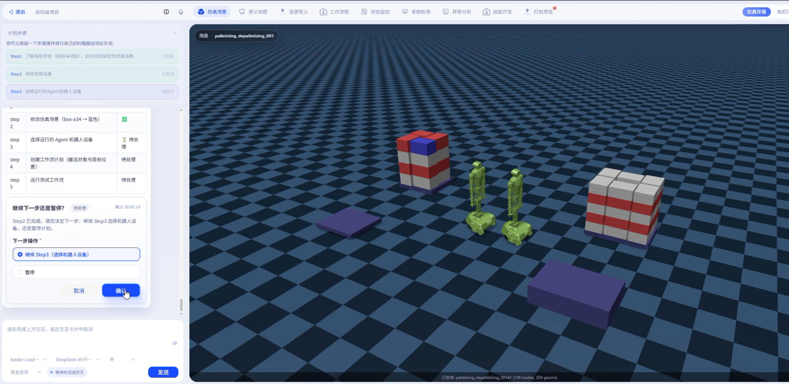

Check or confirm the suggested robot device in the device selection area.

## Step 4: Create a Workflow Plan

**Purpose:** Specify the moving target and destination based on the user input, and let the system generate an executable workflow plan.

- State both the objects to move and the target area in the input.
- Use the box names confirmed in the semantic map to ensure accurate object references.

**Figure 7 Entering a moving task and creating a plan**

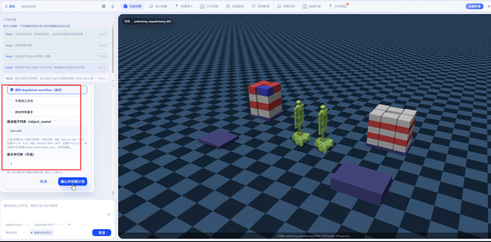

The task description should contain two key pieces of information: “what to move” and “where to move it.”

## Step 5: Run the Workflow and Validate the Result

**Purpose:** Execute the generated workflow and cross-check the Agent's returned information against the actual simulation result.

- Run the generated workflow.
- Check the workflow nodes, the Agent's returned information, and the simulation view to confirm the moving result matches expectations.

**Figure 8 Workflow generated automatically by the system**

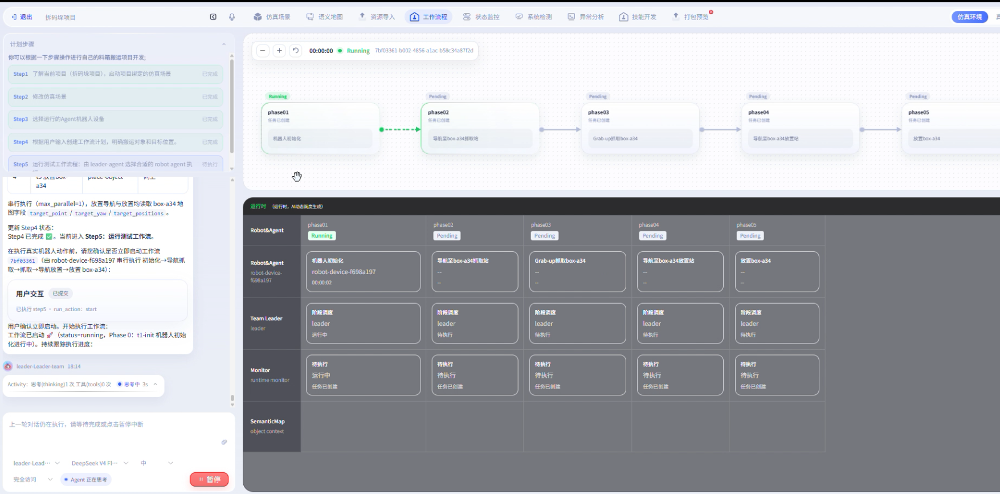

After generation, you can cross-check the task nodes and execution chain in the workflow view.

**Figure 9 Simulation result after the first move**

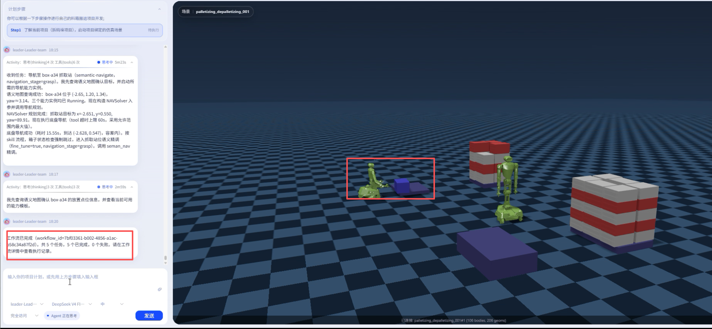

At the end, check both the Agent's returned content and the actual moving result in the scene.

> **Acceptance points:** confirm that the target boxes have entered the designated area and that the workflow has no errors or is not stuck in an unfinished state.

## Adding Extra Moving Tasks

After the first task is complete, you can keep adding moving requirements in the same conversation. The system generates corresponding follow-up workflows based on the new input.

> **Example instruction:** Move `box-a14`, `box-a24`, and `box-a44` to the target position too.

**Figure 10 Entering an additional moving instruction**

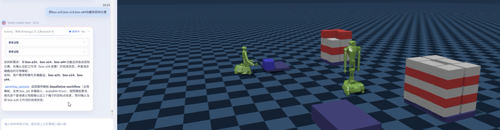

List the boxes to move additionally one by one using the confirmed object names.

**Figure 11 Agent executing the additional moving task**

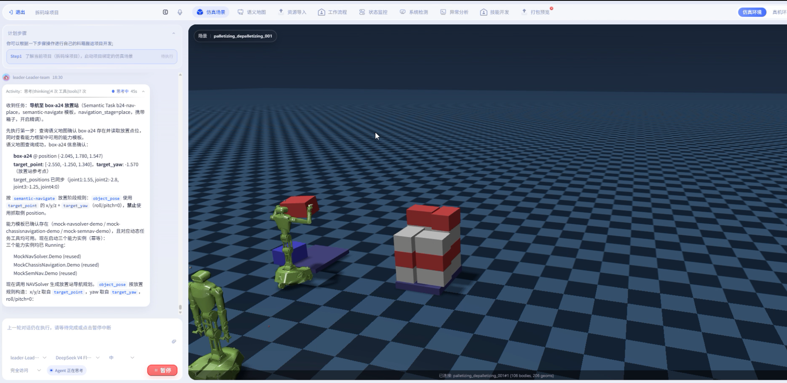

The Agent processes the specified boxes in turn based on the new requirements.

**Figure 12 Scene result after the additional moves**

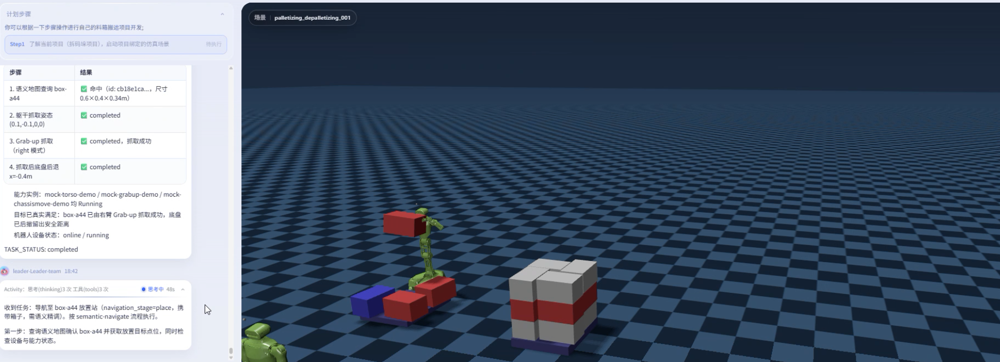

Check the box positions and the target area state again.

**Figure 13 Workflow for the second round of moves**

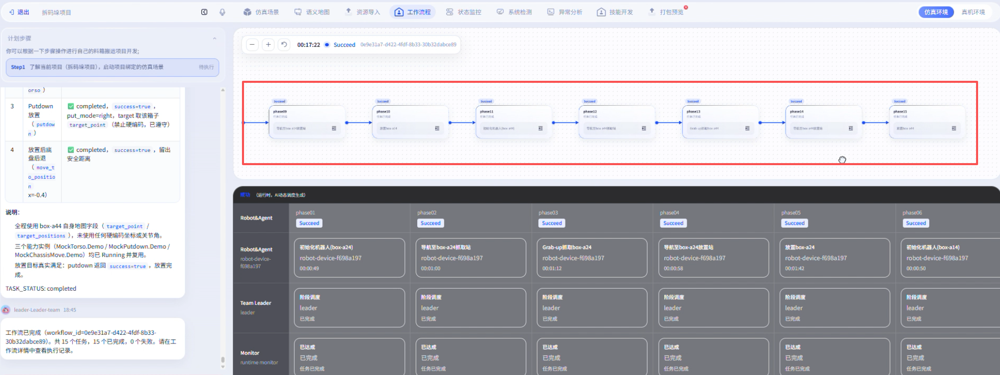

Each additional task generates a corresponding workflow, which you can use to track the execution process.

## Quick Checklist

- Entered the “Depalletizing” project and confirmed the plan steps.
- Agent switched to `leader-Leader-team`.
- Started the simulation scene bound to the project.
- Confirmed the target box names in the semantic map.
- Selected the correct Agent robot device.
- Input includes both the objects to move and the target position.
- Workflow completed, and the Agent's returned result matches the simulation.

> **Troubleshooting:** If the plan is not generated as expected, first check that the Agent role, device selection, object names, and target position description are complete.
