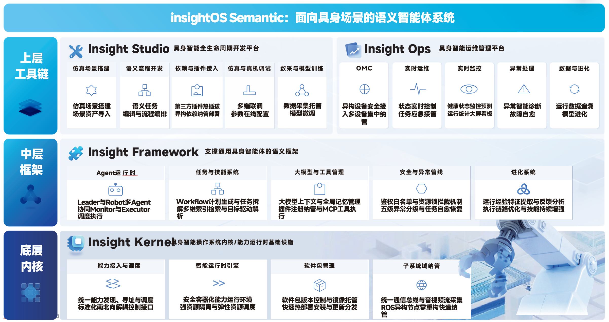

# InsightOS Semantic

[简体中文](../README.zh-CN.md) · [Quick Start](../docs/en/getting-started/quick-start.md) · [User Guide](../docs/en/user-guide/insight-studio-and-projects.md) · [FAQ](../docs/en/reference/faq.md)

> Make every robot capable of doing real work.

InsightOS Semantic is an embodied semantic agent system created for real-world robotic applications. It connects robot embodiments, environments, tasks, Skills, and operational experience through semantics, turning natural-language requests into executable robot tasks across the complete **understand–plan–execute–evolve** loop.

InsightOS Semantic supports scenarios including warehouse picking and delivery, depalletizing and palletizing, multi-robot production lines, and scheduled inspection, and connects humanoids, quadrupeds, manipulators, mobile robots, and other robot embodiments.

## Why InsightOS Semantic

Robots moving from demonstrations to reliable work commonly face three barriers:

- **They cannot understand:** fixed code does not capture human intent or scenario constraints.
- **They cannot adapt:** rigid workflows struggle when the environment, objects, or execution state changes.
- **They cannot evolve:** operational experience is difficult to reuse across robots and scenarios.

InsightOS Semantic uses shared semantics across tasks, environments, embodiments, and abilities so robots can understand goals, compose Skills, execute work, and turn experience into reusable capabilities.

## Product Architecture

### Insight Studio

Create and manage embodied projects with natural language, transforming requirements into task goals, workflows, and Skills connected to semantic world models and simulation.

### Insight Ops

Observe environmental and execution changes, diagnose exceptions, and coordinate recovery and resume so robots can adapt to dynamic scenarios.

### Insight Framework & Kernel

Provide semantic task orchestration, robot and resource management, ability discovery and invocation, world-state synchronization, and operational experience capture.

## Core Features

- **Natural-language task interaction:** describe a goal in one sentence and let the system organize tasks and Skills.
- **Multi-robot collaboration:** assign work across heterogeneous robots and coordinate the workflow.
- **Semantic world model:** represent what objects are, where they are, and how they relate.
- **Dynamic-environment adaptation:** adjust task execution as the environment and execution state change.
- **Simulation-driven development:** connect scenes, robots, Skills, and tasks for rapid simulation validation.
- **Experience and capability evolution:** turn execution data and experience into reusable, continuously improving Skills.
- **Embodied application ecosystem:** reuse scenario applications, Skills, models, plugins, adapters, and simulation assets.

## Try the Public Preview

The Public Preview will provide an installer and depalletizing assets through GitHub Releases. The basic experience is:

1. Download and install the InsightOS Semantic Public Preview.
2. Place the depalletizing asset package in the directory specified by the installation guide.
3. Open Insight Studio in a local browser.
4. Open the Depalletizing project and start its simulation.
5. Inspect the project's Skill documents.
6. Enter “Move the boxes from Area A to Area B and stack them in three layers,” then observe planning and simulation execution.

See the [Quick Start](../docs/en/getting-started/quick-start.md) for the complete flow.

## Open-Source and Distribution Model

InsightOS follows a phased open-source model. The Public Preview first delivers the binaries, example packages, and selected source components required for a complete trial. More modules and new features will open progressively.

| Module | Current plan |
| --- | --- |
| InsightOS repository | Product entry point, documentation, and GitHub Releases |
| Ability Framework | Independent repository; open source |
| Ability SDK | Independent repository; open source |
| Insight Framework | Independent repository; preview binary; source opened progressively |
| Insight Studio & Ops | Independent repository; preview binary; source opened progressively |
| Semantic Map | Independent repository; preview binary; source opened progressively |
| Simulator and simulation assets | Package distribution; assets use separate licenses |
| Ability examples and scenario applications | Example packages with progressively expanded open content |

## Feature Roadmap

| Phase | Feature theme |
| --- | --- |
| **2026 Q3: System Foundation and Public Preview** | Semantic system foundation, simulation resource model, Ability/Skill system, semantic world model, local trial, and starter examples |
| **2026 Q4: Development Capabilities** | Workflow development, Skill development, simulation-scene development, and developer SDKs and toolchains |
| **2027 Q1: Advanced Intelligence** | Experience evolution, continuous Skill improvement, anomaly awareness and handling, task recovery, and dynamic-environment adaptation |
| **2027 Q2: Open Ecosystem** | Scenario applications, Skills, models, plugins, simulation resources, package distribution, and third-party developer collaboration |

## Documentation

- [Getting Started](../docs/en/getting-started/quick-start.md)
- [User Guide](../docs/en/user-guide/insight-studio-and-projects.md)
- [Reference / FAQ](../docs/en/reference/faq.md)

## License

Source code published in this repository is licensed under the [Apache License 2.0](../LICENSE) (`Apache-2.0`). Preview binaries, models, and simulation assets may carry their own licenses in their distribution packages.
